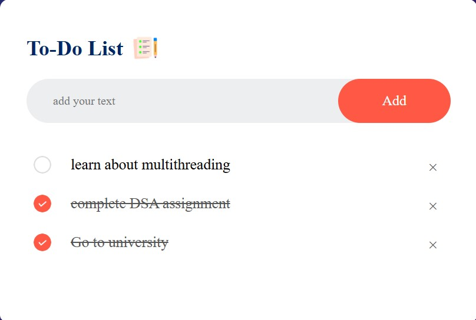

## ✅ To-Do List  

A simple and efficient **To-Do List** application built using HTML, CSS, and JavaScript. Stay organized by adding, managing, and tracking your daily tasks effortlessly.  

## 🚀 Features  
- ✅ Add and delete tasks  
- ✅ Mark tasks as completed  
- ✅ Saves tasks in local storage for persistence  
- ✅ Responsive and user-friendly design  

## 🛠 Tech Stack  
HTML, CSS, JavaScript  

## 📷 Screenshots  
  

## 📌 How to Use  
1. Enter a task in the input field.  
2. Click the **Add** button to save the task.  
3. Mark tasks as complete or remove them when done.  
4. Your tasks remain saved even after refreshing the page.  
  
